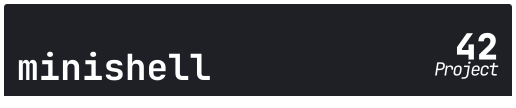

<!-- Header -->

> As beautiful as a shell

This project is about creating a simple shell.
Yes, your own little bash.
You will learn a lot about processes and file descriptors.

Version: `6`

---
<!-- Body -->

## Avaliable Languages

*	[English (EN-USA)][en-usa]
*	[Português (PT-BR)][pt-br]

---
<!-- Footer -->

Check more detailed explanations of project in Wiki page.
Go to [Minishell Wiki page][wiki].

**Author**: [_Thiago Firmino dos S. (thfirmin)_][thfirmin] & [_Lucas Lima (llima)_][llima]   
**Institution**: _42 | Rio_   
**Source**: _Markdown & HTML_

> **_Keep Swimming!_**

##### _Minishell 42|Rio (2023) - thfirmin & llima_

[][42Rio]

<!-- Links -->
[wiki]:<https://github.com/Thfirmin/Minishell/wiki>

[en-usa]:<./.resrcs/rdmeRouter/README.en.md>
[pt-br]:<./.resrcs/rdmeRouter/README.pt.md>
[thfirmin]:<https://github.com/Thfirmin>
[llima]:<https://github.com/Cuelho00>
[42Rio]:<https://42.rio/>
